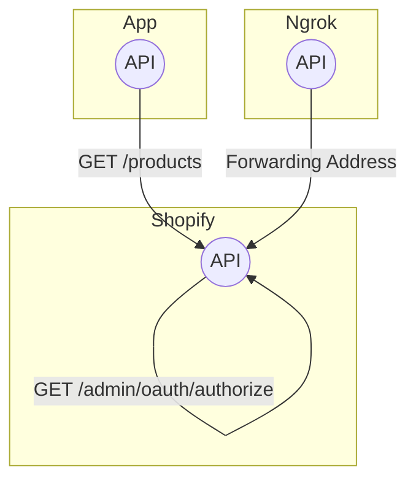

# NestJS Shopify API Example

This is an example application that demonstrates how to use NestJS to build a Shopify API.

## Getting Started

1. Clone this repository.
2. Install dependencies using `npm install`.
3. Set up a [ngrok](https://ngrok.com/) tunnel by running `ngrok http 3000`.
4. Update the `forwardingAddressNgrok` variable in `src/app.controller.ts` with your ngrok URL.
5. Update the `shopName` variable in `src/app.controller.ts` with your Shopify store name.
6. Run the application using `npm start`.

## API Endpoints

### GET /products

This endpoint returns a list of all products in the Shopify store. It requires a valid access token, which is obtained through the Shopify OAuth flow.

## Contributing

Contributions are welcome! If you find a bug or have a feature request, please [open an issue](https://github.com/your-github-username/nestjs-shopify-api-example/issues).

## License

This project is licensed under the MIT License - see the [LICENSE](LICENSE) file for details.
